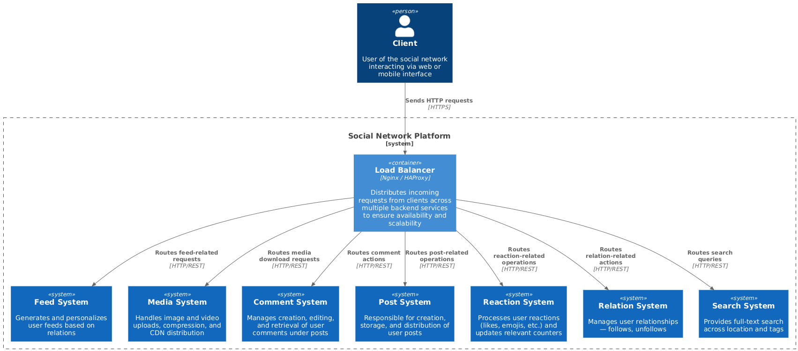
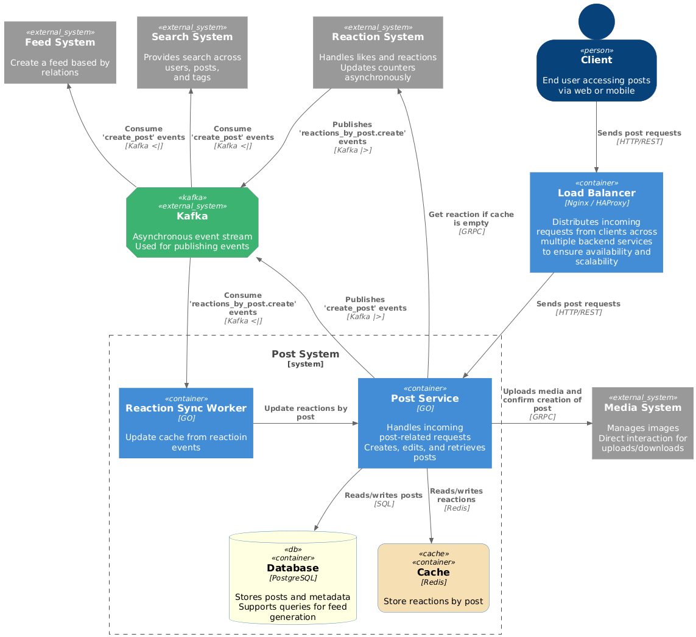
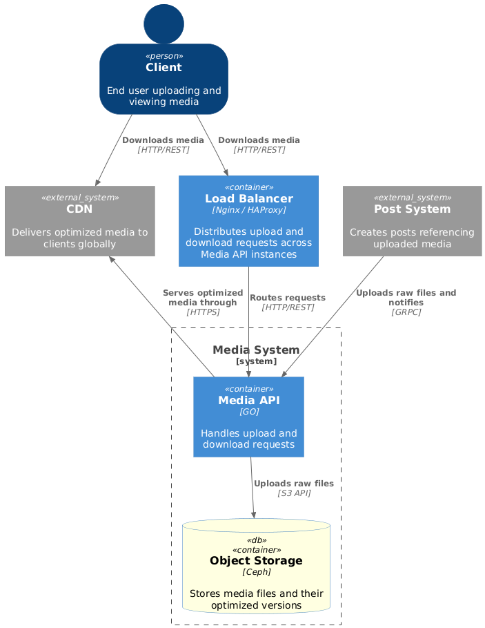
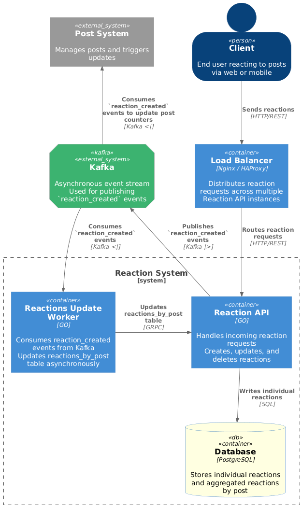
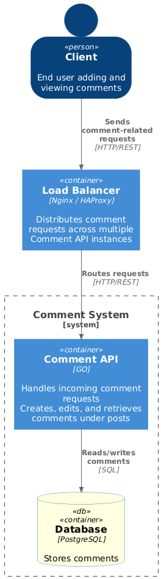
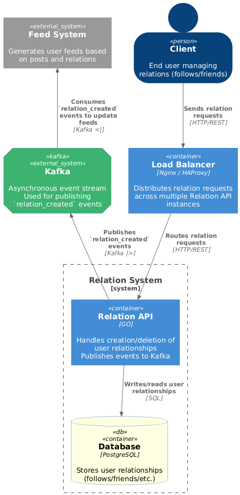
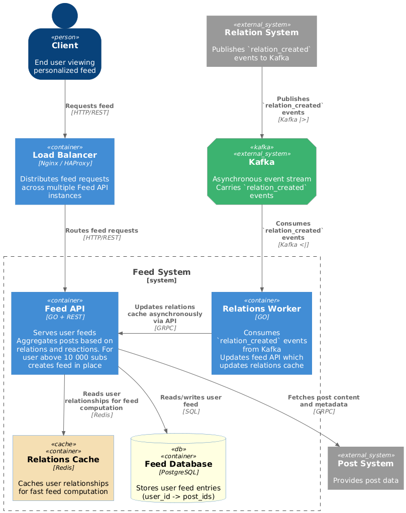
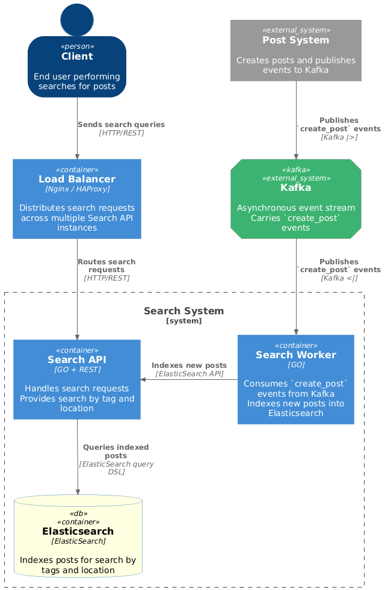

# social_network_system_design

# Функциональные требования

- публикация постов из путешествий с фотографиями, небольшим описанием и привязкой к конкретному месту путешествия;
- оценка и комментарии постов других путешественников;
- подписка на других путешественников, чтобы следить за их активностью;
- поиск популярных мест для путешествий и просмотр постов с этих мест;
- просмотр ленты других путешественников и ленты пользователя, основанной на подписках в обратном хронологическом порядке;

# Не функциональные требования

- ограничения:
    - максимум 10 фото в посте;
    - среднее кол-во фото 6 в посте;
    - максимальный вес фото 2 Мб;
    - средний вес фото при создании поста 1,6 Мб;
    - средний вес фото при получении поста 0,4 Мб;
    - описание максимум 100 символов;
    - комментарии максимум 250 символов;
    - максимум подписчиков 1 000 000;
    - максимум комментарий 10 000;
    - среднее кол-во комментарий к посту 500;

- география и аудитория:
    - DAU 10 000 000;
    - только СНГ;
    - сезонность отпусков(x2 на создание постов);

- доступность и надежность:
    - доступность 99,95%;
    - данные храним всегда;
    - фото храним и отдаем в сжатом виде и до fullHD;

- платформы:
    - мобильные устройства и ВЕБ;

- пользовательская активность:
    - пользователь создает 1 пост в день;
    - пользователь смотрит посты по 10 раз в день;
    - средняя длина ленты 20 постов;

    - ленту грузим без комментарий;
    - пользователь в среднем оставляет 10 комментария в день;
    - пользователь в среднем читает комментарии к 10 постам в день по 100 комментарий за запрос;

    - реакции лайк-дизлайк на пост;
    - пользователь ставит реакции на половину постов которые смотрит, в среднем 100 реакций

    - поиск мест по тегу и имени города/страны;
    - пользователь в среднем ищет места 1 раз в день и получает ленту на 20 постов;

    - пользователь может подписываться и отписываться, среднее кол-во действий 1 в неделю;
    - среднее кол-во подписчиков 1000;

- время отклика:
    - время запроса на создание поста до 2 секунд;
    - время запроса на чтение ленты до 2 секунд;
    - поиск популярных мест до 5 секунд;

# Load

  - RPS
      - RPS(read posts) = 10 000 000 * 3 / 86400 = **350**
      - RPS(write posts) = 10 000 000 / 2 / 86400 = **60**

      - RPS(read comments) = 10 000 000 * 10 / 86400 = **1 200**
      - RPS(write comments) = 10 000 000 * 10 / 86400 = **1 200**

      - RPS(reactions write) = 10 000 000 * 100 / 86400 = **11 600**

      - RPS(search places) = 10 000 000 / 86400 = **120**

      - RPS(subscribe) = 10 000 000 * 0.15 / 86400 = **18**

  - Traffic
      - traffic(read post meta) = rps * avgPostMetaSize *  postsPerRead = 350 * 900 bytes * 20 = **6.3 mb/s**
      - traffic(write post meta) = rps * avgPostMetaSize = 60 * 900 bytes = **54 kb/s**

      - traffic(read post media) = rps * avgPhotoSize * amountPhotos * postsPerRead = 350 * 400 000 bytes * 6 * 20 = **16.8 gb/s**
      - traffic(write post media) = rps * avgUploadPhotoSize * amountPhotos = 60 * 1 600 000 bytes * 6 = **576 mb/s**

      - traffic(write comments) =rps * commentSize =  1200 * 500 bytes = **600 kb/s**
      - traffic(read comments) =rps * commentSize * commentsAmountPerPost  =  1200 * 500 * 100  = **60 mb/s**

      - reactions(react write) = rps * reactionSize = 11 600 * 40  = 23 200 bytes/s = **23 kb/s**

      - search place(places read meta) = rps * avgPostMetaSize * postsPerRead = 120 * 900 bytes * 20 = **2.2 mb/s**
      - search place(places read media) = rps * avgPhotoSize * amountPhotos * postsPerRead = 120 * 400 000 bytes * 6 *20 = **23 gb/s**

      - subscribe (write) = rps * subSize = 18 * 24 bytes = 432 B/s = **0,000432 mb/s**

  - Required memory:

      - Replication factor = 2
      - Replication factor for post = 3
      - Service operation time = 1 years

      - Post: postSize * PRS create * 86400 * 365 = 1090 bytes * 60 * 86400 * 365 = **2 TB**
      - Total for post = 2 TB * 3 replicas + 30 % = **7,8 TB**
    
      - Post_reaction_cache: rowSize * (RPS react / RPS post write) * TTL(10 days) = 100 bytes * (11 600 / 60)  * 86400 * 10 = **17 gB**
  
      - Comments: commentSize * PRS create * 86400 * 365 = 173 bytes * 1 200 * 86400 * 365 = **6.6 TB**
      - Total for comments = 6.6 TB * 2 replicas + 30 % = **17,16 TB**
    
      - Reactions:  reactSize * PRS create * 86400 * 365 = 42 bytes * 11 600 * 86400 * 365 = **15.4 TB**
      - Total for reactions = 15.4 TB * 2 replicas + 30 % = **40.04 TB**
    
      - Reaction_post:  rowSize * (RPS react / RPS post write) * 86400 * 365 = 50 bytes * (11 600 / 60) * 86400 * 365 = **304 GB**
      - Total for reaction_post = 304 GB * 2 replicas + 30 % = **790,4 GB**

      - Subs: subsSize * avgSubs * DAU * 365 = 24 bytes * 1000 * 10 000 000 = **240 GB**
      - Total for subs = 240 GB * 2 replicas + 30 % = **624 GB**
    
      - Search: rowSize * rps(createPost) = 1090 bytes * 60 * 86400 * 365 = **2 TB**
      - Total for search: 2 TB * 3 replicas + 30 % = **7,8 TB**

    Precalculated feed for user under 10 000 subs (80% of users) with 20 post. If the values are higher, the feed is calculated at the time of the request.
    - PreCalcFeed: rowSize * Rps create post * 0.8 * amount of post in feed  := 32 bytes * 60 * 0.8 * 20 * 86400 * 365 = **1 TB**
    - Total for preCalcFeed = 1 TB * 2 replicas + 30 % = **2.6 TB**
    
    - Feed_cache_user_subscription: rowSize(avg sub count 1000) * dau:= 15000 bytes * 610 000 000 = **150 GB RAM**  

    - Photos(S3): avgPhotoSizeCompressed * avgPhotoAmount* RPS create post * 86400 * 365 = (400 000 bytes * 6 * 60) * 86400 * 365 = 4 541.184 TB = **4.6 PB**  
    - Total for photos = 4.6 PT * 2 replicas + 30% = **11.96 PB**

    Required meta memory for 1 year = **69 TB**
    Required media memory for 1 year = **11.96 PB**

# Disks
-------
 ## Posts: Chosen SSD (SATA) 1 disk
  - Post HDD
    - Disks_for_capacity = capacity / disk_capacity = 7.8 TB / 32 TB = 0,24375 disk
    - Disks_for_throughput = traffic / disk_throughput= 6.3 mb/s (no photo in DB) / 100 mb/s = 0.63 disks
    - Disks_for_iops = iops / disk_iops = 410 / 100 = 4.1 disks
    - Disks = 5

  - Post SSD (SATA)
    - Disks_for_capacity = capacity / disk_capacity = 7.8 TB / 100 TB = 0,078 disk
    - Disks_for_throughput = traffic / disk_throughput= 6.3 mb/s (no photo in DB) / 500 mb/s = 0,0126 disks
    - Disks_for_iops = iops / disk_iops = 410 / 1000 = 0.41 disks
    - Disks = 1

  - Post SSD (nVME)
    - Disks_for_capacity = capacity / disk_capacity = 7.8 TB / 30 TB = 0,26 disk
    - Disks_for_throughput = traffic / disk_throughput= 6.3 mb/s (no photo in DB) / 3 000 mb/s = 0,0021 disks
    - Disks_for_iops = iops / disk_iops = 410 / 10 000 = 0.041 disks
    - Disks = 1

  - Post_reaction_cache
    - RAM_capacity = 17 gb

-------
## Comments: Chosen SSD (Sata) 3 disks
  - Comments HDD 
    - Disks_for_capacity = capacity / disk_capacity = 17.16 TB / 32 TB = 0,53625 disk
    - Disks_for_throughput = traffic / disk_throughput= 60.6 mb/s / 100 mb/s = 0,606 disks
    - Disks_for_iops = iops / disk_iops = 2400 / 100 = 24 disks
    - Disks = 24

  - Comments SSD (SATA)
    - Disks_for_capacity = capacity / disk_capacity = 17.16 TB / 100 TB = 0,1716 disk
    - Disks_for_throughput = traffic / disk_throughput= 60.6 mb/s / 500 mb/s = 0,1212 disks
    - Disks_for_iops = iops / disk_iops = 2400 / 1000= 2.4 disks
    - Disks = 3

-------
## Reactions:Chosen SSD (nVME) 4 disks
  - Reactions HDD
    - Disks_for_capacity = capacity / disk_capacity = 40.04 TB / 32 TB = 1,25 disk
    - Disks_for_throughput = traffic / disk_throughput= 0.023 mb/s / 100 mb/s = 0,00023 disks
    - Disks_for_iops = iops / disk_iops = 11 600 / 100 = 116 disks
    - Disks = 116

  - Reactions SSD (SATA)
    - Disks_for_capacity = capacity / disk_capacity = 40.04 / 100 TB = 0,4 disk
    - Disks_for_throughput = traffic / disk_throughput= 0.023 mb/s / 500 mb/s = 0,000046 disks
    - Disks_for_iops = iops / disk_iops = 11 600 / 1000 = 11.6 disks
    - Disks = 12

  - Reactions SSD (nVME)
    - Disks_for_capacity = capacity / disk_capacity = 40.04 / 30 TB = 1.1 disk
    - Disks_for_throughput = traffic / disk_throughput= 0.023 mb/s / 3 000 mb/s = 0,0000076667 disks
    - Disks_for_iops = iops / disk_iops = 11 600 / 10 000 = 1.16 disks
    - Disks = 2 * 2 replicas = 4

 ------
## Subscriptions: Chosen SSD (SATA) 1 disk
  - Subs HDD
    - Disks_for_capacity = capacity / disk_capacity = 0.624 TB / 32 TB = 0,0195 disk
    - Disks_for_throughput = traffic / disk_throughput= 0,000576 mb/s / 100 mb/s = 0,00000576 disks
    - Disks_for_iops = iops / disk_iops = 18 / 100 = 0.18 disks
    - Disks = 1

  - Subs SSD (SATA)
    - Disks_for_capacity = capacity / disk_capacity = 0.624 TB / 100 TB = 0,00624 disk
    - Disks_for_throughput = traffic / disk_throughput= 0,000576 mb/s / 500 mb/s = 0,000001152 disks
    - Disks_for_iops = iops / disk_iops = 18 / 1000 = 0.018 disks
    - Disks = 1

-------   
## Precalculated Feed: Chosen SSD (SATA) 1 disk
  - Precalculated Feed HDD
    - Disks_for_capacity = capacity / disk_capacity = 2.6 TB / 32 TB = 0,08125 disk
    - Disks_for_throughput = traffic / disk_throughput= 2.2 mb/s / 100 mb/s = 0,022 disks
    - Disks_for_iops = iops ((new posts + rps read)* 0.8)/ disk_iops = 328 / 100 = 0.328 disks
    - Disks = 1

  - Precalculated Feed SSD (SATA) 
    - Disks_for_capacity = capacity / disk_capacity = 2.6 TB / 100 TB = 0,026 disk
    - Disks_for_throughput = traffic / disk_throughput= 2.2 mb/s / 500 mb/s = 0,0044 disks
    - Disks_for_iops = iops ((new posts + rps read)* 0.8) / disk_iops = 328 / 1000 = 0.0328 disks
    - Disks = 1

  - Feed_cache_user_subscription
    - RAM_capacity = 150 gb 

-------
## Media: Chosen SSD (SATA) 120 disks
 - Media HDD
    - Disks_for_capacity = capacity / disk_capacity = 11 960 TB / 32 TB = 373,75 disk
    - Disks_for_throughput = traffic / disk_throughput= 17 376 mb/s / 100 mb/s = 173,76 disks
    - Disks_for_iops = iops / disk_iops = 410 / 100 = 4,1 disks
    - Disks = 144 * 2 replicas = 374

  - Media SSD (SATA)
    - Disks_for_capacity = capacity / disk_capacity = 11 960 TB / 100 TB = 119,6 disk
    - Disks_for_throughput = traffic / disk_throughput= 17 376 mb/s / 500 mb/s = 34 752 disks
    - Disks_for_iops = iops / disk_iops = 410 / 1000 = 0,41 disks
    - Disks = 120

-------
## Search: Chosen SSD (SATA) 1 disk
- Post HDD
    - Disks_for_capacity = capacity / disk_capacity = 7.8 TB / 32 TB = 0,24375 disk
    - Disks_for_throughput = traffic / disk_throughput= 6.3 mb/s (no photo in DB) / 100 mb/s = 0.63 disks
    - Disks_for_iops = iops / disk_iops = 410 / 100 = 4.1 disks
    - Disks = 5

- Post SSD (SATA)
    - Disks_for_capacity = capacity / disk_capacity = 7.8 TB / 100 TB = 0,078 disk
    - Disks_for_throughput = traffic / disk_throughput= 6.3 mb/s (no photo in DB) / 500 mb/s = 0,0126 disks
    - Disks_for_iops = iops / disk_iops = 410 / 1000 = 0.41 disks
    - Disks = 1

Total disks:
    - SSD (SATA) = 126 disks
    - SSD (nVME) = 3 + 4 = 7 disks
-------

# Hosts

Hosts = disks / disks_per_host
Hosts_with_replication = hosts * replication_factor 

 - Post
   - Hosts = 1 / 1 = 1
   - Hosts_with_replication = 1 * 3 = 3

 - Comments
   - Hosts = 3 / 1 = 3
   - Hosts_with_replication = 3 * 2 = 6

 - Reactions
   - Hosts = 4 / 1 = 4
   - Hosts_with_replication = 4 * 2 = 8

 - Subs
   - Hosts = 1 / 1 = 1
   - Hosts_with_replication = 1 * 2 = 2

 - Feed
   - Hosts = 1 / 1 = 1
   - Hosts_with_replication = 1 * 2 = 2
   
 - Media
   - Hosts = 120 / 20 = 6
   - Hosts_with_replication = 6 * 2 = 12

- Search
    - Hosts = 1 / 1 = 1
    - Hosts_with_replication = 1 * 3 = 3

Total hosts : 33
-----

Level 1. System context diagram

Level 2. Post system container diagram

Level 2. Media system container diagram

Level 2. Reaction system container diagram

Level 2. Comment system container diagram

Level 2. Relation system container diagram

Level 2. Feed system container diagram

Level 2. Search system container diagram